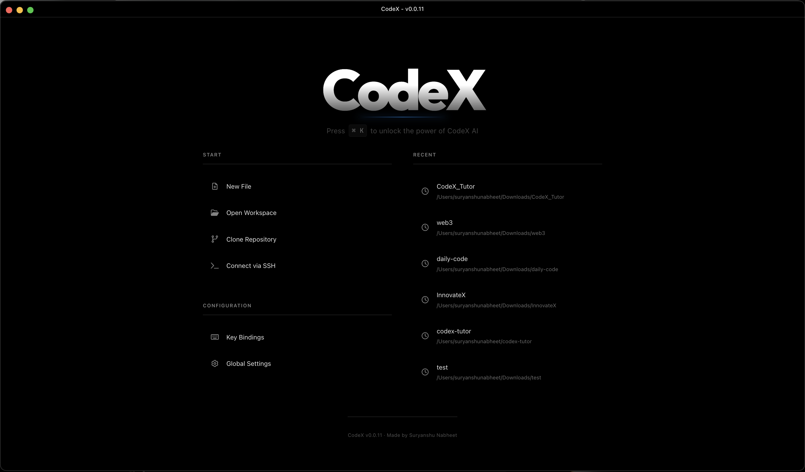

# CodeX IDE

[](LICENSE)

**CodeX is a powerful, offline-first AI-powered code editor with the beautiful Oxocarbon theme.**


.png>)
.png>)
.png>)

## Features

-   **AI-Powered Coding** - Intelligent code generation and assistance
-   **Oxocarbon Theme** - Beautiful IBM Carbon-inspired dark theme
-   **LSP Support** - Full Language Server Protocol support
-   **Integrated Terminal** - Powerful terminal with multiple tabs
-   **Git Integration** - Built-in git support
-   **Offline-First** - Works completely without internet
-   **Cross-Platform** - macOS, Windows, and Linux

## Quick Start

### Prerequisites

-   Node.js 16 or higher
-   npm

### Installation

```bash
# Clone the repository
git clone https://github.com/Suryanshu-Nabheet/CodeX.git
cd CodeX

# Run setup
./setup.sh  # macOS/Linux
.\setup.ps1  # Windows

# Launch CodeX
npm start
```

## Building

Create a distributable package:

```bash
npm run make
```

## Keyboard Shortcuts

### File Operations

-   `Cmd/Ctrl + N` - New File
-   `Cmd/Ctrl + O` - Open Folder
-   `Cmd/Ctrl + S` - Save File
-   `Cmd/Ctrl + W` - Close Tab

### Editor

-   `Cmd/Ctrl + Z` - Undo
-   `Cmd/Ctrl + Shift + Z` - Redo
-   `Cmd/Ctrl + /` - Toggle Comment
-   `Cmd/Ctrl + D` - Select Next Occurrence

### View

-   `Cmd/Ctrl + P` - Quick Open
-   `Cmd/Ctrl + Shift + P` - Command Palette
-   `Cmd/Ctrl + Shift + F` - Search in Files
-   `` Ctrl + ` `` - Toggle Terminal

## Configuration

Copy `.env.example` to `.env` to customize settings:

```bash
cp .env.example .env
```

All configuration is optional. CodeX works perfectly with defaults.

## Supported Languages

-   JavaScript / TypeScript
-   Python
-   Java
-   C / C++
-   Rust
-   Go
-   PHP
-   HTML / CSS
-   JSON / YAML
-   Markdown
-   And many more...

## Project Structure

```
CodeX/
├── src/              # Source code
│   ├── components/   # React components
│   ├── features/     # Redux slices
│   └── main/         # Electron main process
├── assets/           # Icons and static files
└── lsp/              # Language servers
```

## Tech Stack

-   **Electron** - Desktop framework
-   **React** - UI framework
-   **Redux** - State management
-   **CodeMirror 6** - Code editor
-   **TypeScript** - Type safety
-   **Tailwind CSS** - Styling

## Troubleshooting

### Build Issues

```bash
rm -rf node_modules .webpack
npm install
./setup.sh
```

### Performance

-   Close unused tabs
-   Check file size (large files may be slow)
-   Reduce zoom level

## Contributing

Contributions are welcome! Please see [CONTRIBUTING.md](CONTRIBUTING.md) for guidelines.

## License

MIT License - see [LICENSE](LICENSE) file for details.

## Author

**Suryanshu Nabheet**  
Email: suryanshunab@gmail.com

---

Made with ❤️ by Suryanshu Nabheet
